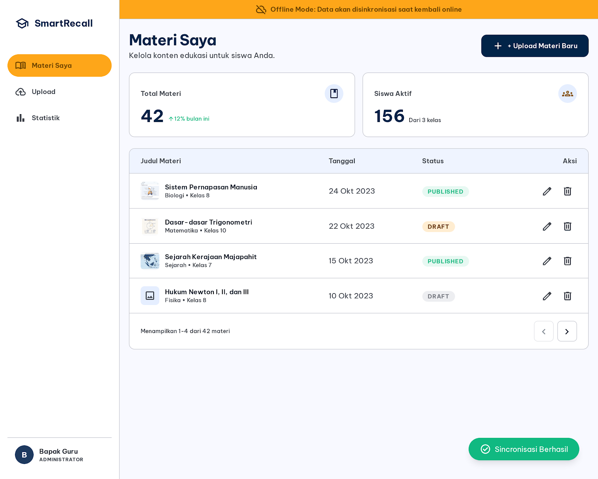
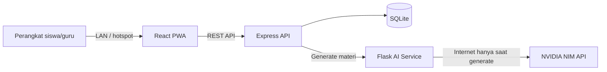

# SmartRecall

Platform microlearning berbasis AI dan spaced repetition untuk membantu sekolah di wilayah 3T menyediakan pembelajaran digital melalui jaringan lokal. Guru dapat mengubah PDF menjadi draft rangkuman, flashcard, dan kuis; siswa tetap dapat belajar dari materi yang sudah tersimpan meski koneksi ke Local Server Hub terputus sementara.



## Fitur utama

- Autentikasi dan pembatasan akses untuk admin, guru serta siswa.
- Upload PDF dengan validasi tipe dan ukuran file.
- Ekstraksi PDF dan pembuatan draft konten melalui NVIDIA NIM.
- Human-in-the-loop: hasil AI harus ditinjau guru sebelum dipublikasikan.
- Editor rangkuman, flashcard, dan bank soal.
- **Manajemen Materi Lanjutan (Folder/Grouping)**: Mengorganisir materi guru di dalam struktur folder secara terpusat.
- Input flashcard manual saat AI atau internet tidak tersedia.
- Materi published-only dan dukungan **Sesi Kelas Terpandu** untuk pengaturan akses aktif di lokal.
- Review flashcard dengan algoritma SM-2.
- Kuis dengan penilaian di server dan riwayat pengerjaan.
- **Admin & Guru Dashboard Interaktif**: Laporan aktivitas belajar siswa, real-time status online dengan Socket.io, beserta statistik skor kualitas dan analisis partisipasi kelas.
- PWA dengan app-shell cache, cache materi, IndexedDB, offline queue, dan sinkronisasi ulang yang lebih tangguh (termasuk *offline folder visibility*).
- **Desain Responsif & Mobile-Friendly**: Termasuk layout tabel dan komponen utama yang dioptimalkan untuk berbagai layar (scrollable tables).
- SQLite sebagai sumber data utama agar mudah dijalankan pada satu laptop sekolah.

## Arsitektur



Frontend hanya berkomunikasi dengan backend. `ai-service` adalah satu-satunya komponen yang membutuhkan internet publik, dan hanya ketika guru membuat konten AI. IndexedDB digunakan sebagai cache serta antrean sementara; progres final tetap disimpan di SQLite.

## Teknologi

| Bagian | Teknologi |
| --- | --- |
| Frontend | React 18, Vite, Tailwind CSS, PWA, IndexedDB |
| Backend | Node.js 20, Express, Prisma, SQLite, JWT, Socket.io |
| AI service | Python 3.11, Flask, pdfplumber, Sastrawi, requests |
| AI provider | NVIDIA NIM (`meta/llama-3.1-8b-instruct`) |
| Testing | Jest, Vitest, Testing Library, Pytest |
| Deployment | Docker Compose atau proses lokal |

## Struktur proyek

```text
smartrecall/
├── ai-service/          # Ekstraksi PDF, preprocessing, dan NVIDIA NIM
├── backend-api/         # Gateway API, auth, database, SM-2, dan kuis
├── frontend-web/        # React PWA untuk guru dan siswa
├── docs/                # PRD, arsitektur, API spec, dan referensi desain
├── docker-compose.yml
└── README.md
```

## Prasyarat

- Node.js 20 atau lebih baru
- npm 10 atau lebih baru
- Python 3.11 atau lebih baru
- API key NVIDIA NIM untuk generate AI
- Docker dan Docker Compose, opsional

## Menjalankan secara lokal

### 1. Clone dan siapkan environment

```bash
git clone https://github.com/USERNAME/smartrecall.git
cd smartrecall

cp ai-service/.env.example ai-service/.env
cp backend-api/.env.example backend-api/.env
cp frontend-web/.env.example frontend-web/.env
```

Ganti `USERNAME` dengan pemilik repository. Kemudian atur minimal:

```dotenv
# ai-service/.env
AI_PROVIDER=nvidia
NIM_API_KEY=your_nvidia_nim_api_key

# backend-api/.env
JWT_SECRET=ganti_dengan_random_secret_yang_panjang
```

Jangan commit file `.env` atau API key ke Git.

### 2. Jalankan AI service

```bash
cd ai-service
python3 -m venv .venv
source .venv/bin/activate
pip install -r requirements.txt
python app.py
```

AI service tersedia di `http://localhost:5001`.

Untuk Windows PowerShell, aktifkan virtual environment dengan:

```powershell
.venv\Scripts\Activate.ps1
```

### 3. Jalankan backend

Buka terminal baru:

```bash
cd backend-api
npm ci
npx prisma generate
npx prisma migrate deploy
npm run seed
npm run dev
```

Backend tersedia di `http://localhost:3000`.

### 4. Jalankan frontend

Buka terminal baru:

```bash
cd frontend-web
npm ci
npm run dev -- --host 0.0.0.0
```

Buka `http://localhost:5173` di browser.

## Menjalankan dengan Docker Compose

Salin ketiga file environment seperti langkah sebelumnya, isi `NIM_API_KEY` dan `JWT_SECRET`, lalu jalankan:

```bash
docker compose up --build
```

| Service | URL |
| --- | --- |
| Frontend | `http://localhost:5173` |
| Backend API | `http://localhost:3000` |
| AI service | `http://localhost:5001` |

Hentikan service dengan `docker compose down`. Tambahkan `-v` hanya jika Anda memang ingin menghapus volume/data lokal.

## Akun demo

Setelah `npm run seed`:

| Peran | Username | Password |
| --- | --- | --- |
| Guru | `guru_demo` | `guru123` |
| Siswa | `siswa_demo` | `siswa123` |

> Akun ini hanya untuk development/demo. Ganti password sebelum digunakan pada lingkungan nyata.

## Variabel environment

### AI service

| Variabel | Keterangan | Default |
| --- | --- | --- |
| `AI_PROVIDER` | Provider AI aktif | `nvidia` |
| `NIM_API_KEY` | API key NVIDIA NIM | wajib untuk generate |
| `NIM_API_BASE_URL` | Base URL NVIDIA NIM | `https://integrate.api.nvidia.com/v1` |
| `NIM_MODEL_NAME` | Model yang digunakan | `meta/llama-3.1-8b-instruct` |
| `PORT` | Port AI service | `5001` |
| `UPLOAD_FOLDER` | Folder upload sementara | `./uploads` |
| `MAX_CONTENT_LENGTH_MB` | Batas ukuran PDF | `20` |
| `NIM_REQUEST_TIMEOUT_SECONDS` | Timeout request NVIDIA NIM | `60` |
| `NIM_MAX_RETRIES` | Maksimum retry NVIDIA NIM | `4` |
| `NIM_RATE_LIMIT_SLEEP_SECONDS` | Jeda retry saat rate limit | `30` |
| `AI_INTER_REQUEST_DELAY_SECONDS` | Jeda antar request generate berurutan | `6` |

### Backend

| Variabel | Keterangan | Default |
| --- | --- | --- |
| `PORT` | Port backend | `3000` |
| `DATABASE_URL` | Lokasi SQLite untuk Prisma | `file:./database/dev.db` |
| `JWT_SECRET` | Secret penandatanganan JWT | wajib diganti |
| `JWT_EXPIRES_IN` | Masa berlaku token | `7d` |
| `AI_SERVICE_URL` | URL internal AI service | `http://localhost:5001` |
| `AI_SERVICE_TIMEOUT_MS` | Timeout dari backend ke AI | `65000` |
| `FRONTEND_ORIGIN` | Origin frontend yang diizinkan | `http://localhost:5173` |

### Frontend

| Variabel | Keterangan | Default |
| --- | --- | --- |
| `VITE_BACKEND_API_URL` | URL backend yang dapat dijangkau browser | `http://localhost:3000` |

Untuk perangkat lain di LAN, ubah URL frontend/backend yang relevan menjadi IP laptop server, misalnya `http://192.168.1.10:3000`.

## Endpoint utama

| Method | Endpoint | Akses | Kegunaan |
| --- | --- | --- | --- |
| `POST` | `/auth/register-guru` | Publik | Membuat akun guru |
| `POST` | `/auth/register-siswa` | Publik | Membuat akun siswa |
| `POST` | `/auth/login` | Publik | Login guru atau siswa |
| `POST` | `/materi/upload` | Guru | Upload dan generate materi dari PDF |
| `GET` | `/materi` | Guru/siswa | Daftar materi sesuai role |
| `GET` | `/materi/:id/draft` | Guru | Melihat draft hasil AI |
| `POST` | `/materi/:id/approve` | Guru | Approve atau reject materi |
| `POST` | `/flashcard/manual` | Guru | Menambah flashcard manual |
| `POST` | `/review` | Siswa | Menyimpan skor review SM-2 |
| `GET` | `/review/schedule/:siswa_id` | Siswa | Jadwal review siswa |
| `GET` | `/soal/materi/:id` | Guru/siswa | Mengambil soal materi published |
| `POST` | `/soal/submit` | Siswa | Menilai dan menyimpan kuis |
| `GET` | `/health` | Publik | Health check backend |

Kontrak lengkap tersedia di [`docs/API_SPEC.md`](docs/API_SPEC.md).

## Menjalankan test

```bash
# Backend
cd backend-api
npm ci
npx prisma generate
npm test

# Frontend
cd ../frontend-web
npm ci
npm test
npm run build

# AI service
cd ../ai-service
source .venv/bin/activate
python -m pytest tests
```

## Mode offline dan Local Server Hub

1. Jalankan ketiga service pada laptop server.
2. Hubungkan laptop dan perangkat siswa ke Wi-Fi/hotspot yang sama.
3. Cari IP lokal laptop (`ipconfig getifaddr en0` pada macOS atau `ipconfig` pada Windows).
4. Buka `http://IP-LAPTOP:5173` dari perangkat siswa.
5. Buka materi saat server tersedia agar aset dan data dapat masuk cache.
6. Jika koneksi LAN terputus saat review, submission disimpan di IndexedDB dan dikirim ulang ketika tersambung.

Database SQLite tetap menjadi source of truth. Jangan menggunakan IndexedDB sebagai penyimpanan progres permanen.

## Alur penggunaan

### Guru

1. Login sebagai guru.
2. Upload PDF dan beri judul materi.
3. Tunggu proses generate AI.
4. Tinjau serta edit rangkuman, flashcard, dan soal.
5. Approve materi agar dapat diakses siswa.
6. Gunakan input manual jika AI tidak tersedia.

### Siswa

1. Login sebagai siswa.
2. Pilih materi yang sudah published.
3. Baca rangkuman dan review flashcard.
4. Berikan skor kualitas 0–5 untuk perhitungan SM-2.
5. Kerjakan kuis dan lihat hasilnya.

## Troubleshooting

### Generate AI gagal

- Pastikan `NIM_API_KEY` valid dan tidak memiliki spasi tambahan.
- Pastikan laptop memiliki internet saat guru menekan generate.
- Periksa health check: `curl http://localhost:5001/health`.
- Pastikan PDF memiliki teks yang dapat diekstrak, bukan hanya gambar hasil scan.

### Backend gagal menemukan database

```bash
cd backend-api
npx prisma generate
npx prisma migrate deploy
```

### Frontend tidak dapat mengakses backend dari HP

- Gunakan IP laptop, bukan `localhost`, pada `VITE_BACKEND_API_URL`.
- Jalankan Vite dengan `--host 0.0.0.0`.
- Izinkan port `3000` dan `5173` pada firewall.

### Service worker masih memakai versi lama

Tutup seluruh tab SmartRecall, buka kembali aplikasi, atau hapus storage situs melalui DevTools lalu reload.

## Dokumentasi

- [Product Requirements Document](docs/PRD.md)
- [Arsitektur sistem](docs/ARCHITECTURE.md)
- [Spesifikasi API](docs/API_SPEC.md)
- [Panduan desain](docs/design/contextual_learning_guide/DESIGN.md)

## Keamanan sebelum deployment

- Rotasi API key yang pernah dibagikan melalui chat, screenshot, atau commit.
- Gunakan `JWT_SECRET` acak dan panjang.
- Jangan commit `.env`, database SQLite, upload PDF, log, atau hasil build.
- Ganti kredensial akun demo.
- Batasi akses Local Server Hub hanya untuk jaringan sekolah yang dipercaya.

---

Dibangun untuk menghadirkan pembelajaran adaptif yang tetap dapat digunakan pada konektivitas terbatas.
